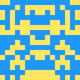
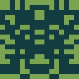

# PixlHash

## Download

Gradle:
```groovy
compile 'de.baerinteractive:pixlhash:0.1.0'
```

## Usage

To get a Bitmap from a String simply use this piece of code:
```java
PixlHash pixlHash = new PixlHash();
Bitmap bitmap1 = pixlHash.getPixlHash("test-string");
Bitmap bitmap2 = pixlHash.getPixlHash("example-image");
```

##Results

test-string:



example-image:



## Author

Fettn,
Kim Lan Bui

## License

PixlHash is available under the MIT license. See the LICENSE file for more info.
